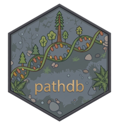

# pathdb <a href="https://aidanfred24.github.io/pathdb/"></a>

**pathdb** is an R package designed to facilitate access to the South Dakota State University (SDSU) bioinformatics database (used in [iDEP](https://bioinformatics.sdstate.edu/idep/)) and perform essential data preparation tasks for gene expression analysis.

It allows users to seamlessly retrieve species-specific gene and pathway information and process RNA-Seq data for downstream analysis using standard Bioconductor workflows.

## Installation

You can install the development version of pathdb from GitHub:

```r
# install.packages("remotes")
remotes::install_github("aidanfred24/pathdb")
```

## Core Features

- **Centralized Database Access**: Connect directly to the SDSU bioinformatics database to fetch comprehensive gene and pathway data.
- **Species Identification**: Quickly determine if your organism of interest is supported using various search queries (common names, scientific names).
- **ID Standardization**: Convert gene identifiers into standard Ensembl formats to ensure compatibility with differential expression or pathway enrichment analysis tools.
- **Data Pre-processing**: Clean and transform raw RNA-Seq count matrices (e.g., handling missing values, filtering low counts, applying VST/rlog transformations) for differential expression analysis.

## Quick Overview

Instead of walking through a complete data analysis pipeline (which you can find in our [vignettes](#vignettes-and-documentation)), here is a brief look at how `pathdb` can be used to access genomic information for your species of interest:

```r
library(pathdb)

# 1. Check if your species is supported
species_info <- search_species(query = "Human", name_type = "primary")
human_id <- species_info$id[1] # ID is 96

# 2. Standardize gene IDs in your expression data
data(hypoxia_reads)
clean_data <- convert_id(
  genes = rownames(hypoxia_reads),
  data = hypoxia_reads,
  species_id = human_id
)

# 3. Process data for downstream analysis
processed_data <- process_data(
  data = clean_data,
  missing_value = "geneMedian",
  min_cpm = 0.5,
  counts_transform = 0 # 0 returns raw counts, 1=log2(CPM), 2=VST, 3=rlog
)

# 4. Retrieve pathways for your genes of interest
pathways <- get_pathways(
  species_id = human_id,
  genes = rownames(processed_data),
  category = "GOBP"
)
```

## Vignettes and Documentation

For detailed, step-by-step tutorials on how to fully utilize `pathdb`, please refer to the package vignettes:

- **Database Access and Preparation**: `vignette("data-access", package = "pathdb")`
- **Pathway Enrichment Analysis**: `vignette("path-enrichment", package = "pathdb")`

## Requirements

*   R >= 4.1.0
*   **Imports**: `RSQLite`, `DESeq2`, `edgeR`, `dplyr`, `SummarizedExperiment`, `BiocGenerics`, `R.utils`
